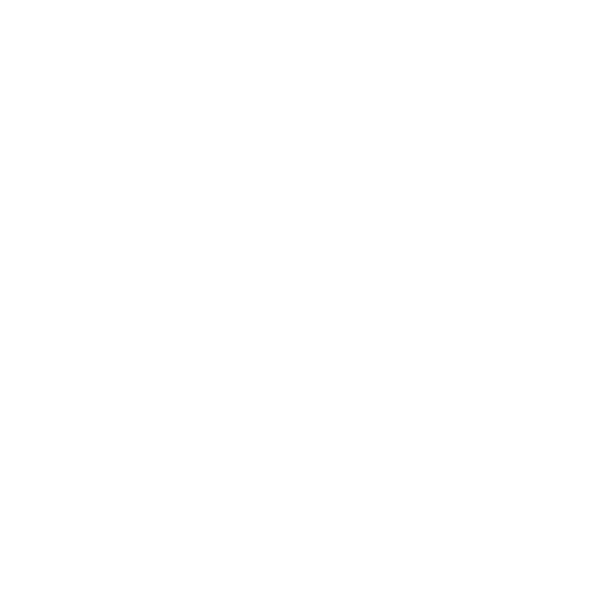

<div align="center">
  
</div>

<div align="center">


</div>

## About

Mo is a reverse ingenereed neuro server 

## Fast Start

```bash
# build the mo 
go build ./cmd/mo

# start the mo
./mo
```

<div align="center">

---

### Contact

Telegram: [zarazaex](https://t.me/zarazaexe)
<br>
Email: [zarazaex@tuta.io](mailto:zarazaex@tuta.io)
<br>
Site: [zarazaex.xyz](https://zarazaex.xyz)

</div>